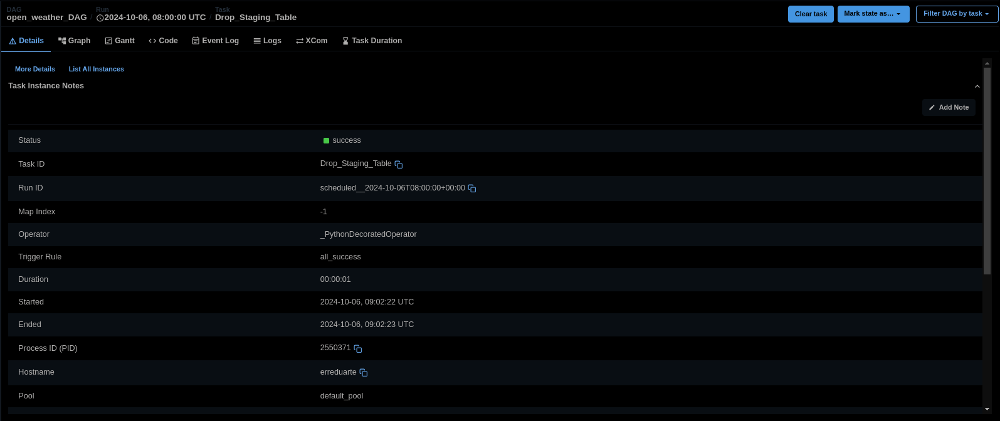
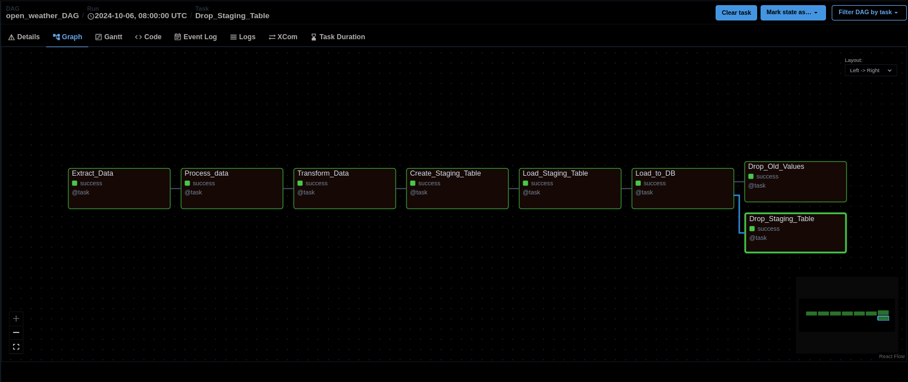
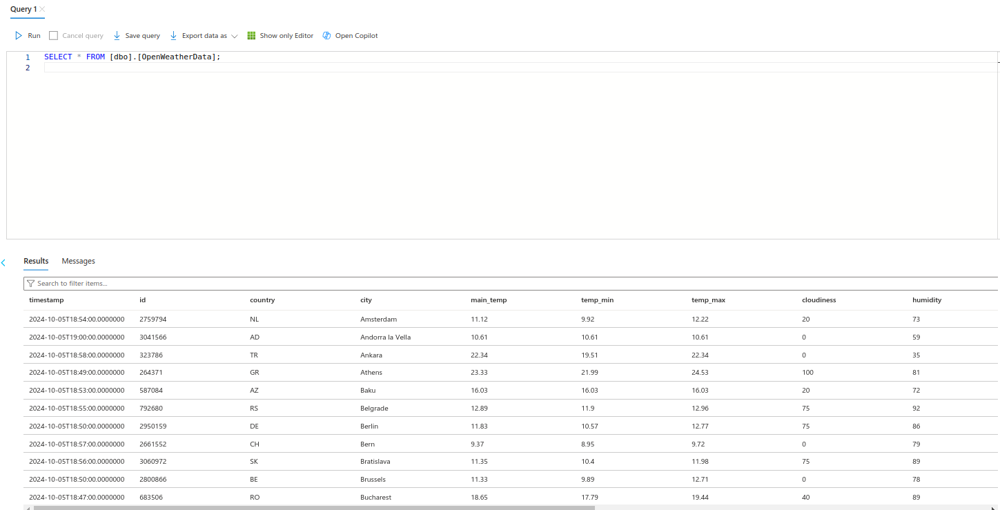

## Pipeline Execution Overview

### Airflow DAG and Task Success
Below are screenshot details of the Airflow UI showing a successful DAG run for this pipeline:
 
 

##### -**DAG GENERAL VIEW:**
  
 1 -  General Details
   
 
 2 - Graph Run VIew  
 

- **Tasks Logs**

Below are log details for each of the Airflow successful tasks run for this pipeline:

- TASK 1: Fetch Data 
  

- TASK 2: Process Fetched Data
  

- TASK 3: Transform Data
  

- TASK 4: Create Staging Table
  

- TASK 5: Load Staging Table
  

- TASK 6: Populate Database
  

- TASK 7: Drop values older than 24h
  

- TASK 8: Drop Staging Table
  

### Data Overview

This section provides an overview of the outcome data processed during the project. The folder contains three files that demonstrate the data at different stages:

1. : This file contains the raw data extracted from the OpenWather API, stored in blob files after processing fetched data.
   
2. : This file includes the transformed data.
   
3. A sample result of the final database query, illustrating how the transformed data was loaded into the database and can be queried.
   

